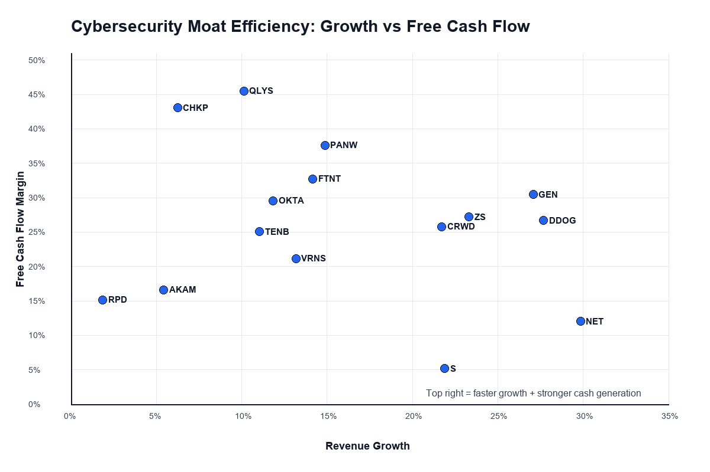

# Cybersecurity Industry Tracker

Small `yfinance` pipeline for collecting financial statements, market data, and derived operating metrics for public cybersecurity companies.



## Quick Start

```bash
python3 scripts/cybersecurity_yfinance_pipeline.py
```

Outputs are written under `data/yfinance_cybersecurity/<run_date>_<run_time>/`.

Useful files:

- `summary_metrics.csv` - one row per company with market, valuation, growth, margin, spending, balance-sheet, and cash-flow metrics.
- `company_profiles.csv` - Yahoo profile fields such as sector, industry, employee count, market cap, beta, and exchange.
- `raw_statements/*.csv` - annual and quarterly balance sheets, income statements, and cash-flow statements.
- `prices/*.csv` - daily adjusted price history for the lookback window.
- `run_metadata.json` - tickers, run date, and output locations.

## Default Company Universe

The script focuses on public companies where Yahoo Finance can expose ticker-level data:

`PANW`, `CRWD`, `FTNT`, `ZS`, `OKTA`, `S`, `CHKP`, `GEN`, `TENB`, `QLYS`, `RPD`, `VRNS`, `NET`, `AKAM`, `DDOG`

Some names are adjacent to cybersecurity rather than pure-play security. Keep or remove them depending on the thesis angle:

- `NET`, `AKAM`: edge/network/security platforms
- `DDOG`: observability platform with cloud security products
- `CYBR`: useful for historical CyberArk work, but may be unavailable in Yahoo after acquisition/delisting activity

## Examples

Run a custom basket:

```bash
python3 scripts/cybersecurity_yfinance_pipeline.py --tickers CRWD PANW FTNT ZS OKTA S
```

Pull quarterly metrics and five years of prices:

```bash
python3 scripts/cybersecurity_yfinance_pipeline.py --period quarterly --price-years 5
```

Write somewhere else:

```bash
python3 scripts/cybersecurity_yfinance_pipeline.py --output-dir data/cyber_run
```

## Notes

`yfinance` depends on Yahoo Finance endpoints. Missing fields are common, especially for newly listed companies, delisted companies, or statement lines that are named differently by company. The script keeps going when one ticker has missing data and records warnings in `run_metadata.json`.
